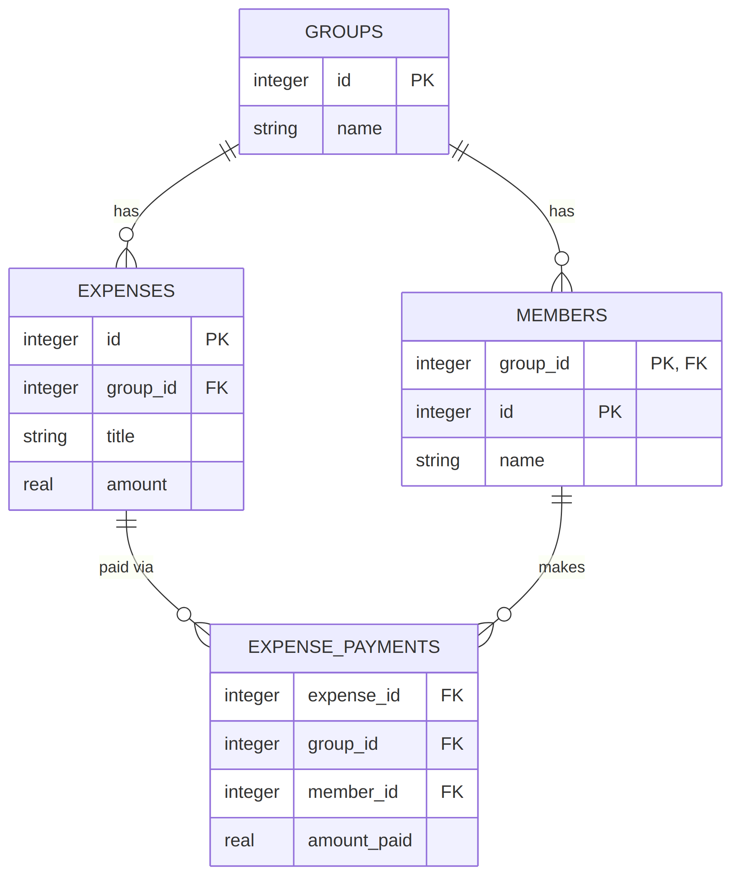

# SmartSplit — Database Schema

This documents the actual SQLite schema created by `Database::initialize()` in `src/database/Database.cpp`. Kept as its own file, separate from `README.md`, so schema changes don't get lost inside the feature-level docs.

---

## ER Diagram

## Table Reference

### `groups`

```sql
CREATE TABLE IF NOT EXISTS groups
(
    id INTEGER PRIMARY KEY,
    name TEXT NOT NULL
);
```

| Column | Type | Constraint | Notes |
|---|---|---|---|
| `id` | INTEGER | **PK** | Global, unique per group. Generated in application code as `MAX(id)+1`, not `AUTOINCREMENT`. |
| `name` | TEXT | `NOT NULL` | Group display name. |

---

### `members`

```sql
CREATE TABLE IF NOT EXISTS members
(
    group_id INTEGER NOT NULL,
    id INTEGER NOT NULL,
    name TEXT NOT NULL,

    PRIMARY KEY(group_id, id),

    FOREIGN KEY(group_id)
    REFERENCES groups(id)
);
```

| Column | Type | Constraint | Notes |
|---|---|---|---|
| `group_id` | INTEGER | **PK (composite)**, **FK → groups(id)** | Which group this member belongs to. |
| `id` | INTEGER | **PK (composite)** | Scoped to `group_id`, not global. Group A's member `1` and Group B's member `1` are different people. Generated as `MAX(id)+1 WHERE group_id = ?`. |
| `name` | TEXT | `NOT NULL` | Member display name. |

**Why a composite key:** a single-column `id` can't express "this value is only unique within a group." `PRIMARY KEY(group_id, id)` enforces uniqueness on the pair, so member IDs restart at 1 for every new group.

---

### `expenses`

```sql
CREATE TABLE IF NOT EXISTS expenses
(
    id INTEGER PRIMARY KEY,
    group_id INTEGER NOT NULL,
    title TEXT NOT NULL,
    amount REAL NOT NULL,

    FOREIGN KEY(group_id)
    REFERENCES groups(id)
);
```

| Column | Type | Constraint | Notes |
|---|---|---|---|
| `id` | INTEGER | **PK** | Global across all groups (unlike `members.id`), generated as `MAX(id)+1` with no `WHERE` filter. |
| `group_id` | INTEGER | `NOT NULL`, **FK → groups(id)** | Which group this expense was logged in. |
| `title` | TEXT | `NOT NULL` | Expense description. |
| `amount` | REAL | `NOT NULL` | Total expense amount. |

---

### `expense_payments`

```sql
CREATE TABLE IF NOT EXISTS expense_payments
(
    expense_id INTEGER NOT NULL,
    group_id INTEGER NOT NULL,
    member_id INTEGER NOT NULL,
    amount_paid REAL NOT NULL,

    FOREIGN KEY(expense_id)
    REFERENCES expenses(id)
);
```

| Column | Type | Constraint | Notes |
|---|---|---|---|
| `expense_id` | INTEGER | `NOT NULL`, **FK → expenses(id)** | Which expense this payment goes toward. |
| `group_id` | INTEGER | `NOT NULL` | Carried alongside `member_id` because `members.id` alone is ambiguous across groups (see below). |
| `member_id` | INTEGER | `NOT NULL` | Together with `group_id`, identifies the paying member. |
| `amount_paid` | REAL | `NOT NULL` | How much this member contributed to the expense. |

**No primary key on this table.** Nothing currently stops the same `(expense_id, member_id)` pair from being inserted twice.

---

## PK / FK Summary

| Table | Primary Key | Foreign Keys |
|---|---|---|
| `groups` | `id` | — |
| `members` | `(group_id, id)` | `group_id → groups(id)` |
| `expenses` | `id` | `group_id → groups(id)` |
| `expense_payments` | *none declared* | `expense_id → expenses(id)` |

**Relationship that exists in practice but isn't declared as a schema-level FK:**
`expense_payments.(group_id, member_id) → members.(group_id, id)`. This is enforced only by application code (services always pass a `group_id` they've already validated) — the schema itself doesn't have a composite foreign key statement for it.

---

## Constraints That Are *Not* Enforced (Important)

SQLite does not turn on foreign key enforcement by default — `FOREIGN KEY` clauses in `CREATE TABLE` are honored only if the connection has run:

```sql
PRAGMA foreign_keys = ON;
```

This project's `Database::open()` does not currently set that pragma. So right now:
- You *can* insert a `member` with a `group_id` that doesn't exist in `groups`.
- You *can* insert an `expense_payment` referencing an `expense_id`/`member_id` combination that doesn't exist.
- Nothing in SQLite itself will reject any of this — the FK clauses in the schema above are documentation of intent, not active guards, until the pragma is turned on.

If you want the constraints to actually bite, add this one line right after `sqlite3_open` in `Database::open()`:

```cpp
sqlite3_exec(db, "PRAGMA foreign_keys = ON;", nullptr, nullptr, nullptr);
```

---

## Relationships in Plain English

- One **group** has many **members**. A member belongs to exactly one group.
- One **group** has many **expenses**. An expense belongs to exactly one group.
- One **expense** has many **expense_payments** (one row per person who contributed toward it).
- One **member** can appear in many **expense_payments** (across different expenses in their group).

---

## Quick Inspection Commands

```bash
sqlite3 data/smartsplit.db
```

```sql
.headers on
.mode column
.tables
.schema members
SELECT * FROM groups;
SELECT * FROM members;
SELECT * FROM expenses;
SELECT * FROM expense_payments;
.quit
```

Run each `.` command and `SELECT` on its own line — the sqlite3 shell does not strip trailing `--` comments the way a `.sql` script file would.
